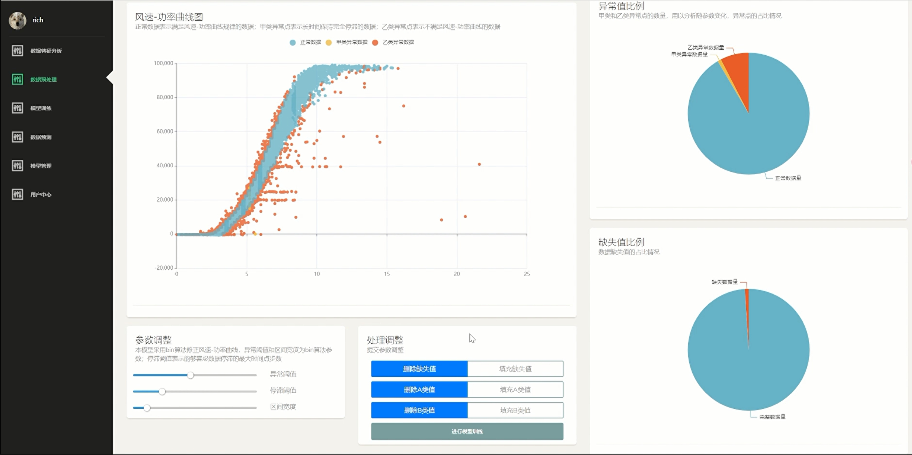

# Aeolus WindTech: Longyuan Wind Power Prediction and Analysis System

## 🌐 Project Overview

Developed by the Invincible Fried Chicken Team, "Aeolus WindTech" is aimed at enhancing the accuracy of power prediction in wind farms. Our system integrates advanced machine learning and deep learning models to provide reliable data support for the operation of wind farms.

## 🏆 Background and Challenges

With the rapid development of clean energy, wind power has become a crucial renewable energy source. However, wind power prediction faces challenges of randomness and accuracy, impacting the balance of power supply and demand. Our system improves prediction accuracy through optimized algorithms and data processing methods, providing strong support for the electricity market.

## 🔍 Technical Highlights

- **Neural Network Model**: Our MRN-2 model achieves excellent results in algorithm rankings. By combining a dual-input structure of primary and secondary variables, it realizes high-precision wind power prediction.
- **Data Preprocessing**: The innovative bin-plus algorithm is used for handling outlier data, significantly enhancing data quality and the performance of the prediction model.
- **User Interface**: Offers a flexible and straightforward visualization system for data analysis and real-time prediction.

## 🖥️ System Features

- **Data Feature Analysis Interface**: Analyzes and displays key features of wind power data.
- **Data Preprocessing Interface**: Processes and corrects outlier data.
- **Model Weight Training Interface**: For model training and parameter adjustments.
- **Future Data Prediction Interface**: Provides power prediction for future time periods.

## 🎥 Demo Video

## 🔗 GitHub Repository

For more details about our project, please visit our [GitHub repository](https://github.com/Zzz212zzZ/china-software-cup).

## 🙏 Acknowledgements

We thank the China Software Cup committee and Baidu for organizing the wind power track competition. This competition has brought us knowledge and experience, allowing our team to grow through challenges.

---

© 2023 Invincible Fried Chicken Team - Aeolus WindTech: Longyuan Wind Power Prediction and Analysis System